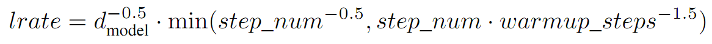

# State of the art results

## Facebook FairSeq

#### Citation

```
@article{gehring2017convs2s,
  author          = {Gehring, Jonas, and Auli, Michael and Grangier, David and Yarats, Denis and Dauphin, Yann N},
  title           = "{Convolutional Sequence to Sequence Learning}",
  journal         = {ArXiv e-prints},
  archivePrefix   = "arXiv",
  eprinttype      = {arxiv},
  eprint          = {1705.03122},
  primaryClass    = "cs.CL",
  keywords        = {Computer Science - Computation and Language},
  year            = 2017,
  month           = May,
}
```
and
```
@article{gehring2016convenc,
  author          = {Gehring, Jonas, and Auli, Michael and Grangier, David and Dauphin, Yann N},
  title           = "{A Convolutional Encoder Model for Neural Machine Translation}",
  journal         = {ArXiv e-prints},
  archivePrefix   = "arXiv",
  eprinttype      = {arxiv},
  eprint          = {1611.02344},
  primaryClass    = "cs.CL",
  keywords        = {Computer Science - Computation and Language},
  year            = 2016,
  month           = Nov,
}
```

#### Configurations

- Dataset: en-fr: WMT14 English-French
    - Origin sentence pairs: 36M
    - Filter: length > 175 || ratio of len(src) and len(tgt) > 1.5
    - Result sentence pairs: **33.5M**
    - Test dataset: newstest2014
    - Vocabulary: source and target combined, **40K** BPE types
    - Validation dataset: 0.5% ~ 1% of training dataset
    
- Model Parameters:
    - Embedding size: **512**
    - Embedding + positional encoding
    - **8** M40 GPU, **37** days
    - Batch size: **32** on each worker
    - Encoder layers: **15**
    - Decoder layers: **15**
    - Hidden units: (both for encoder & decoder)
        - **512** for first **5** layers, kernel size: **3**
        - **768** for next **4** layers, kernel size: **3**
        - **1024** for next **3** layers, kernel size: **3**
        - **2048** for next layer, kernel size: **1**
        - **4096** for next layer, kernel size: **1**
        - Effective context size: 25
    - Dropout: Use dropout on the embeddings, input of the convolutional blocks, decoder output; dropout detail unknown

- Optimizer:
    - Algorithm: *Nesterov's accelerated gradient method*
    - Momentum: 0.99
    - Initial learning rate: **0.25**
    - Fine-tune: Once the validation PPL stops improving, we reduce the learning rate by an order of magnitude after each *epoch*
    until it falls below **1e−4**

- Evaluation:
    - Average of 3 runs with different random seed
    - Beam size: **5**
    - For word-based models: Add *UNK replacement* based on attention scores after generation


## Google All Attention

#### Citation

```
```

#### Configurations (Big model, 41.0 BLEU)

- Dataset: en-fr: WMT14 English-French
    - Sentence pairs: **36M**, seems no filter
    - Test dataset: newstest2014
    - Vocabulary: source and target combined, **32K** BPE types

- Model Parameters:
    - Embedding size: **512**
    - Embedding + positional encoding
    - **8** P100 GPU, **3.5** days
    - Batch size: 4096
    - Encoder layers: **6**
    - Decoder layers: **6**
    - Hidden size: **1024**
    - Feed forward size: **8192**
    - Dropout: Use dropout on the embeddings, each sub-layer (before residual add); drop rate P_drop: **0.3** (**0.1** for single GPU)
    - Attention dropout:
    - Label smoothing: **0.1**
    - Maxlen: **256**
    - Weight decay: **0.0**
    - See more parameters in function `transformer_base` and `transformer_big_enfr` of
    [this file](https://github.com/tensorflow/tensor2tensor/blob/master/tensor2tensor/models/transformer.py)

- Optimizer:
    - Algorithm: *Adam*, \beta_1: **0.9**, \beta_2: **0.98**, \epsilon: **1e-9**
    - Fine-tune: Linearly increase in warm up steps, then decrease it proportionally to the inverse square root of the step number;
     warm up steps = 4000

- Evaluation:
    - Beam size: **4**
    - Length penalty \alpha: 0.6
